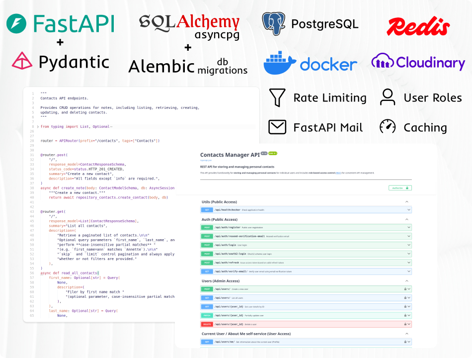

# Fullstack Web Development with Python <!-- omit in toc -->

### [# goit-pythonweb-hw-12](https://github.com/topics/goit-pythonweb-hw-12) <!-- omit in toc -->

<p align="center">
  
</p>

## Building a REST API for Contact Management using FastAPI. <!-- omit in toc -->

This project demonstrates the use of **FastAPI** to build a REST API for managing users and their personal contacts. Project is built with **SQLAlchemy ORM** for relational **PostgreSQL** database operations, **Alembic** for schema migrations, and other technologies. It is packed inside of **Docker** container and uses **Redis** for caching and **Cloudinary** to store image files.

<p align="center">
  
</p>

The main goal for the app is to store and manage user contacts.

## Key Features
- JWT-based authentication
- User email verification
- Role-based access control (USER / MODERATOR / ADMIN / SUPERADMIN)
- Full CRUD for contacts (user-isolated)
- Redis caching (contacts, users, counters)
- Rate limiting for sensitive endpoints
- Avatar upload via Cloudinary
- Dockerized dev & prod environments

## Architecture Overview

The project follows a layered architecture:

- API layer (FastAPI routers)
- Service layer (business logic, validation, permissions)
- Repository layer (SQLAlchemy ORM)
- Providers (cache, external services, email, avatars)
- DTOs for data transfer
- Centralized domain event logging

## Table of Contents <!-- omit in toc -->
- [Key Features](#key-features)
- [Architecture Overview](#architecture-overview)
- [Task Requirements](#task-requirements)
  - [Goal](#goal)
  - [Technical Specification](#technical-specification)
    - [1. Contacts](#1-contacts)
    - [2. API](#2-api)
    - [3. CRUD + Extra Features](#3-crud--extra-features)
  - [General Requirements](#general-requirements)
- [Task Solution](#task-solution)
  - [Solution Description](#solution-description)
  - [Project Setup \& Run Instructions](#project-setup--run-instructions)
    - [Prerequisites](#prerequisites)
    - [Setting Up the Development Environment](#setting-up-the-development-environment)
      - [1. Clone the Repository and Install Dependencies](#1-clone-the-repository-and-install-dependencies)
      - [2. Setup application environment variables](#2-setup-application-environment-variables)
      - [3. Build and run](#3-build-and-run)
      - [4. Connection to the database or redis](#4-connection-to-the-database-or-redis)
      - [5. Start FastAPI application](#5-start-fastapi-application)
      - [6. Access API docs and make API requests](#6-access-api-docs-and-make-api-requests)
      - [7. Local debugging](#7-local-debugging)
- [License](#license)

## Task Requirements

### Goal

Create a REST API for storing and managing personal contacts.
The API must be built with FastAPI and use SQLAlchemy to work with a database.

### Technical Specification

#### 1. Contacts

Design a database to store contact information.

Each contact record must include:
* First name
* Last name
* Email address
* Phone number
* Birthday
* Additional information (optional)

#### 2. API

Develop an API, that should support basic data operations.

It must support following functions and provide endpoints to:
* Create a new contact
* Retrieve a list of all contacts
* Retrieve a single contact by its ID
* Update an existing contact
* Delete a contact

#### 3. CRUD + Extra Features

In addition to standard CRUD operations, the API must also:
* Allow searching contacts by first name, last name, or email using query parameters.
* Provide an endpoint to retrieve contacts who have birthdays within the next 7 days.

### General Requirements

1. Use FastAPI to implement the REST API.
2. Use SQLAlchemy ORM for database operations.
3. Use PostgreSQL as the database.
4. Support CRUD operations for contacts.
5. Store each contact's birthday.
6. Expose Swagger documentation for the REST API.
7. Validate request data with Pydantic models.
8. Implement user authentication using JWT tokens (all operations with contacts are available for authenticated users only).
9. Use has access for their own contacts and operations with those contacts.
10. Implement user email verification for registered users.
11. Limit number of requests to the `/me` route.
12. Turn on CORS for the REST API.
13. Implement possibility of avatar update (user Cloudinary service).


## Task Solution

### Solution Description

The solution consists of a **PostgreSQL database** running in a Docker container, a **FastAPI server** for handling HTTP API requests and managing contacts in the database, and **Swagger/OpenAPI documentation** that describes all available endpoints and allows you to try out requests directly from the documentation.

### Project Setup & Run Instructions

This guide will help you set up the environment and run the project.

#### Prerequisites

Before you begin, make sure you have the following installed:

* **[Python 3.12.*](https://www.python.org/downloads/)** (tested with Python 3.12.3) — Required to run the application locally.
* **[Poetry](https://python-poetry.org/)** - To manage dependencies in virtual environment.
* **[Docker](https://www.docker.com/)** using PostgreSQL (tested with PostgreSQL 17.5) — Used to containerize the application in a unified environment using Docker or Docker Compose.
* Email that allows you to send messages using API calls (meta.ua was used and test for this build as a practical example, but it may be other as meta.ua requires ukrainian mobile phone number)
* Registered account at [cloudinary](https://cloudinary.com/) and its API keys.
* Optional - for local development:
  * **[Git](https://git-scm.com/downloads)** — To clone the repository, version control and development.
  * **[VS Code](https://code.visualstudio.com/download)** or another IDE — Recommended for browsing and editing the project source code, run using run scripts and overall development.
  * **DBeaver** or **PgAdmin** to access and see your PostgreSQL database information

#### Setting Up the Development Environment

##### 1. Clone the Repository and Install Dependencies

1. Clone repository:
    ```bash
    git clone https://github.com/oleksandr-romashko/goit-pythonweb-hw-12.git
    cd goit-pythonweb-hw-12
    ```
    or download the ZIP archive from [GitHub Repository](https://github.com/oleksandr-romashko/goit-pythonweb-hw-12/) and extract it.
2. Install project dependencies:
    ```bash
    poetry install
    ```

##### 2. Setup application environment variables

The application requires several environment variables to operate correctly.

**Note on Production environment**

In production, environment variables and secrets must be provided externally (e.g., GitHub Actions, Docker environment variables, deployment platform, etc.). The application in production ***does not load `.env` files***.

**Development environment**

For local development, copy `.env.example` → `.env`.

This file contains all required configuration values.
Some variables have mandatory validation (mostly security-related).  
If left with their default placeholder values, the application will refuse to start (see `./src/config/app_config.py` for more information on required variables).

These mandatory variables include:
```
    "AUTH_JWT_SECRET"
    "CACHE_PASSWORD"
    "DB_ADMIN_USER"
    "DB_ADMIN_USER_PASSWORD"
    "DB_APP_USER_PASSWORD"
    "DB_ADMIN_PANEL_PASSWORD"
    "MAIL_JWT_SECRET"
    "MAIL_USERNAME"
    "MAIL_PASSWORD"
    "CLOUDINARY_NAME"
    "CLOUDINARY_API_KEY"
    "CLOUDINARY_API_SECRET"
```

When such variables contain invalid/default values, the application will print detailed log messages describing which variable must be fixed. Check the `api` service container logs for guidance.

##### 3. Build and run

Our app solution uses Docker to run our app and other necessary services in a Docker compose environment. That includes:
* Our FastApi api application
* Redis cache service
* Postgres database
* PgAdmin to access database

We may use `makefile` to build and run our environment in Docker.
* For the production setup run this command while in the project root directory:
  `make prod`
* or for the development setup run other command:
  `make dev`
  Dev environment allows additional features:
    * auto-reload of the app upon code changes while develop
    * extra details on errors as part of response and `debug` error logging level
    * extra http header with processing time of the request handling
    * CORS allows all origins
    * database and cache ports are exposed and accessible from outside of compose environment
    * Compose run not in daemon mode

##### 4. Connection to the database or redis

In `prod` environment you won't have direct access to the application database or cache services. However in `dev` environment respective ports will be forwarded and you may access them directly.

##### 5. Start FastAPI application

Before we may start our FastAPI application it is wise to check our application settings. Check your `.env` file and change FastApi application settings if necessary.

Then start FastApi application by using following command:

```shell
make dev
```

This will start application and it will be accessible at [http://0.0.0.0:8000](http://0.0.0.0:8000) (depending on your `WEB_PORT` settings).

##### 6. Access API docs and make API requests

You may access Swagger API documentation at [http://0.0.0.0:8000/docs](http://0.0.0.0:8000/docs) and make API requests from there.

**Example API Request**

```http
POST /api/auth/register
Content-Type: application/json

{
  "username": "john_doe",
  "email": "john@example.com",
  "password": "strong_password"
}
```

##### 7. Local debugging

1. Start infrastructure:
    ```shell
    make dev
    ```
2. Stop API container:
    ```shell
    make api-stop
    ```
3. Set breakpoint(s).
4. Press `F5` in VS Code or run **API: Debug (local)** profile manually.
5. When finished, stop debugger and start API container again:
    ```shell
    make api-start
    ```

**Happy coding!**

## License

This project is licensed under the [MIT License](./LICENSE).
You are free to use, modify, and distribute this software in accordance with the terms of the license.